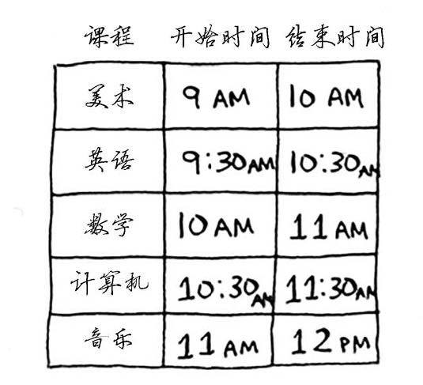

# <center> 贪心(greedy)基础 和 常用STL</center>

## 基础贪心

> 引言：
> 算法可以贪心
> 因为算法贪心可以解决
> 生活中的大部分问题
> 越是贪心的人 越可精通greedy
### 定义
>​         贪心法是一种解决最优问题的策略。它是从问题的初始解出发，按照当前最佳的选择，把问题归纳为更小的相似的子问题，并使子问题最优，再由子问题来推导出全局最优解。

#### 贪心的特点
1. 贪心算法是在每一步求解的步骤中，它要求“贪婪”的选择最佳操作，**并希望通过一系列的最优选择，能够产生一个问题的（全局的）最优解**。
2. 贪心选择性质：算法中每一步选择都是当前看似最佳的选择，这种选择依赖于已做出的选择，但不依赖于未做的选择。
3. 贪心算法不是对所有问题都能得到整体最优解，关键是贪心策略的选择。
4. 选择的贪心策略必须具备**<font color = red>无后效性</font>**，即某个状态以前的过程不会影响以后的状态，只与当前状态有关。


### 教室调度问题 [HDU-2037](http://acm.hdu.edu.cn/showproblem.php?pid=2037)

假设有如下课程表，你希望将尽可能多的课程安排在某间教室上。



> 输入
> 第一行课程数量n
> 第二至n+1行 每行两个整数，s 和 t，表示课程的开始时间和结束时间
> 输出
> 一行整数表示最多课程数量

策略：
1. 选出结束最早的课，它就是要在这间教室上的第一堂课。

2. 因为选择结束最早的课，之后必定要选择开始时间在这节课结束之后，且结束最早的课。

3. 以此类推，重复1-2的选择操作，直到所有课程都被删选完成。


```cpp
根据这种局部的最优策略，推出全局的最优解。
思路：
1. 结束的时间从小到大排序，如果结束的时间相同，开始时间较早的那个排在前面。
2. 选择第一个先结束的节目作为一个标准，后面的课程如果开始时间晚于其结束的时间，说明这两个课程并不冲突。
3. 接着将后面这个课程作为新的标准，一次类推直至遍历完所有的课程。
```


> 贪心与递推：与递推不同的是，贪心法中推进的每一步不是依据某一固定的递推式，而是当前看似最佳的贪心决策，不断的将问题归纳为更加小的相似的子问题。所以归纳、分析、选择正确合适的贪心策略，是正确解决贪心问题的关键。


### 合并果子 [洛谷P1090]( https://www.luogu.org/problem/P1090 )

有N堆果子，每堆果子有自己的果子数$a[i]$，每次可以合并任意两堆果子，合并后消耗的体力为两堆果子果子数之和。求最终合并成一堆后消耗的最小体力。

$1 \leq N \leq 10000$

> 输入：
>
> 共两行。
> 第一行是一个整数 $n$，表示果子的种类数。
>
> 第二行包含 $n$个整数，用空格分隔，第 $i$ 个整数$a[i]$是第 $i$ 种果子的数目。
>
> 输出：
>
> 一个整数，也就是最小的体力耗费值。

> 输入样例：
>
> ```
> 3 
> 1 2 9 
> ```
>
> 输出样例：
>
> ```
> 15
> ```

N堆果子合并成一堆，必定需要操作N-1此。每次合并为体力为$a[i]+a[j]$。
最终消耗的体力之和是每堆果子的数量乘上其参与合并的次数。
所以要体力最小，就需先合并最轻的果子，然后重复这个操作。

理想复杂度$O(NlogN)$，在$O(logN)$的时间里找出最值。

### 贪心小结
​         贪心作为一种解题思路，虽然有时很难证明它的正确性，但在无法找到其他算法的时候，不失为一种好方法。
​         并且，贪心与其他算法的结合，来优化已有的算法(`搜索剪枝、DP优化`)。其余很多的算法都是基于贪心证明的（`最短路、最小生成树`）。


## STL  [^1]

### 什么是STL

​        **STL(Standard Template Library)** 即**标准模板库**。它是一个具有工业强度，高效的C++程序库。它包含了诸多在计算机科学领域里所常用的基本数据结构和算法。 

​        STL组成的六部分：**算法、容器**、迭代适配器、**迭代器**、仿函数、空间配制器。

- **容器**（Container）是一种数据结构，如list，vector，和deques ，以模板类的方法提供。为了访问容器中的数据，可以使用由容器类输出的迭代器；
- **迭代器**（Iterator）提供了访问容器中对象的方法。例如，可以使用一对迭代器指定list或vector中的一定范围的对象。迭代器就如同一个指针。事实上，C++的指针也是一种迭代器。但是，迭代器也可以是那些定义了operator*()以及其他类似于指针的操作符地方法的类对象；
- **算法（Algorithm）**，是用来操作容器中的数据的模板函数。例如，STL用sort()来对一个vector中的数据进行排序，用find()来搜索一个list中的对象，函数本身与他们操作的数据的结构和类型无关，因此他们可以在从简单数组到高度复杂容器的任何数据结构上使用；
    - **[beg, end)**
    - **alg(beg, end, other args);**
    - **alg(beg, end, dest, other args);**
    - **alg(beg, end, beg2, other args);**
    - **alg(beg, end, beg2, end2, other args);**
- 仿函数（Functor）
- 适配器（Adaptor）
- 分配器（allocator）

### 常用容器

1. 简单容器：pair
2. 序列容器：vector,list,forward_list(单向链表),deque(双端队列),arry(C++14)
3. 容器适配器：queue,priority_queue,stack
4. 关联容器：set,multiset,map,multimap,
(unordered_set,unordered_multiset,unordered_map,unordered_multimap)
5. 其他容器：bitset, valarry.

### pair 对

- 头文件 `#include<utility>`
- 定义：`pair<typename1, typename2> var_name`
    - 相当于一个结构体 有 first 和 second 的两个元素
- 访问：`var_name.first / var_name.second`
- 比较原则：先比较first，first相同时再比较second。

### vector 变长数组

- 头文件`#include <vector>`

- 定义
    - `vecotr<typename> var_name`
    - `vector<typename> var_name(size)`
        - 例：`vector<int> pos`，`vector<int> a(10)`

- 访问

    - 通过下标 `var_name[index]`

    - 使用`.at`方法 `var_name.at(index)`，会越界抛出异常。

    - 使用迭代器

        ```cpp
        for (vector<typename>::iterator it = var_name.begin(); it != var_name.end(); it++) {
            cout << *it << endl;
        }
        ```

        或者使用C++11的特性

        ```cpp
        for (auto x : var_name) {
            cout << x << endl;
        }
        ```
        
    - 正确/错误使用（适用于所有可随机访问的结构）

        <font color = green>正确</font>

        ```cpp
        vector<int> a(10);
        cout << a[9] << endl;
        ```

        <font color = red>错误</font>

        ```cpp
        vector<int> a;
        a.push_back(5);
        cout << a[9] << endl;// vector内部元素不足9，无法访问，不可使用下标
        //允许cout << a[0] << endl;
        ```

- 常用方法

    - `push_back(type x)`
- 功能：尾部插入一个元素x
  
- 复杂度：$O(1)$
  
- `pop_back()`
  
    - 功能：删除尾部的一个元素
    - 复杂度：$O(1)$
      
    
- `size()`

    - 功能：返回vector的长度
    - 复杂度：$O(1)$

```cpp
#include <iostream>
#include <vector>
using namespace std;
int main(void) {
    vector<int> a;
    a.push_back(1);
    a.push_back(3);
    a.push_back(2);
    for (int i = 0; i < a.size(); i++) {
        cout << a[i] << endl;
    }
    cout << endl;
    a.pop_back();
    for (int i = 0; i < a.size(); i++) {
        cout << a[i] << endl;
    }
    return 0;
}
```

### string 字符串

- 头文件`#include <string>`
- 输入输出只能用`cin cout`
- 定义
    - `string var_name`
- 常用方法和vector类似，获取长度使用`length()`
- 可以使用 `+= ` 拼接字符串，`!=` 和 `==` 通过字典序比较字符串

### stack 栈

- 头文件 `#include <stack>`
- 定义
  
    - `stack<typename> var_name`
- 先进后出结构
- 常用方法
  
    - `push(type x)`
        - 功能：入栈
        - 复杂度：$O(1)$
    
    - `top()`
        - 功能：取出栈顶的元素
        - 复杂度：$O(1)$
    - `pop()`
        - 功能：弹出栈顶元素
        - 复杂度：$O(1)$
    - `empty()`
        - 功能：返回`bool`型，判断栈是否为空
        - 复杂度：$O(1)$
    - `size()`
        - 功能：返回栈的长度
        - 复杂度：$O(1)$
    

### queue 队列

- 头文件 `#include <queue>`
- 定义
    - `queue<typename> var_name`
- 先进先出结构
- 常用方法
    - `push(type x)`
        - 功能：入队
        - 复杂度：$O(1)$
    - `front()/back()`
        - 功能：取出队首/队尾元素
        - 复杂度：$O(1)$
    - `pop()`
        - 功能：出队
        - 复杂度：$O(1)$
    - `empty()`
        - 功能：判断队列是否为空
        - 复杂度：$O(1)$
    - `size()`
        - 功能：返回队列内的元素个数
        - 复杂度：$O(1)$          

### priority_queue 优先队列/堆(heap)   [^2]

- 底层使用`vector`实现，可以在$O(logN)$的时间内弹出最值。

- 头文件 `#include <queue>`

- 定义

    - `priority_queue<typename> var_name`

        例：

        - 普通内置类型

        ```cpp
        priority_queue<int> q;
        priority_queue<int,vector<int>,less<int> > q;//数字大的优先级大
        priority_queue<int,vector<int>,greate<int> > q;//数字小的优先级大
        注：vector<int>是来承载底层heap的容器。less<int>与greater<int>是对第一个参数的比较
        类。
        ```

        - 结构体

        ```cpp
        struct node {
            int x;
            double y;
            bool operator<(const node &obj) const {
                return x < obj.x;   //x大的优先级高
            }
        };
        ```

- 常用方法

    - `top()`
        - 功能：取出顶部的元素
        - 复杂度：$O(1)$
    - `push(type x)`
        - 功能：加入队列
        - 复杂度：$O(logN)$
    - `pop()`
        - 功能：删除顶部元素
        - 复杂度：$O(logN)$
    - `size()`
        - 功能：返回元素个数
        - 复杂度：$O(1)$
    - `empty()`
        - 功能：判断堆是否为空
        - 复杂度：$O(1)$

### map 映射关系

- 头文件 `#include <map>`

    - 定义

        - `map<key typename, value typename> var_name`

- 访问

    - 使用下标 `mp[key]`，返回对应的`vlaue`

    - 使用迭代器 或 C++11的`rang_for`

    ```cpp
    for(map<typename1, typename2>::iterator it = mp.begin(); it != mp.end();it++){
        it->first; //访问键
        it->second;//访问值
    }
    for (auto &x : mp) {// 这里的x表示的是map中的元素
        x.first;
        x.second;
    }	
    ```

- 常用方法
  
    - `find(key)`
        -  功能：返回key的映射的迭代器 
        - 复杂度：$O(logN)$
    - `size()`
        - 功能：返回map的长度
        - 复杂度：$O(1)$
    - `clear()`
        - 功能：清空
        - 复杂度：$O(N)$
    - easer()
        - 功能：删除元素
        - `easer(it)`  删除it指向的元素。$O(1)$ 
        - `erase(key)` 删除键中为key的值。$O(logN)$
        - `erase(first,last)` 删除$[first,last)区间元素、O(last-first)$ 

### set 集合
- 头文件 `#include <set>`

- 特性：自动排序 去重重复内容
  
  - 定义
    
    - `set<typename> var_name`
    
  - 访问：只能通过迭代器来访问。
  
      ```cpp
      for (set<typename>::iterator it = var_name.begin(); it != var_name.end(); it++) {
          cout << *it << endl;
      }
      //C++11
      for (auto x : var_name) {
          cout << x << endl;
      }
      ```
  
  - 常用方法
  
      - `insert()`
          - 功能：向集合插入一个元素
          - 复杂度：$O(logN)$
      - `find(value)`
          - 功能：返回对应值为value的迭代器
          - 复杂度：$O(logN)$
      - `size()`
          - 功能：返回集合大小
          - 复杂度：$O(1)$
      - `clear()`
          - 功能：清空容器
          - 复杂度：$O(N)$
      - `erase`
          - `name.erase(it)` 删除当前迭代器it指向的值。时间复杂度$O(1)$
          - `name.erase(value)` 删除value这个值。时间复杂度$O(logN)$
          - `name.erase(first,last)` 删除区间[first，last)内的元素。时间复杂度$O(last-first)$.first与last都为迭代器

### 算法库 algorithm

头文件 `#include <algorithm>`

### sort

- 默认升序重新排序指定访问的元素。可重载。
- 复杂度：$O(NlogN)$

- 用法
    - `sort(begin, end)`
    - `sort(begin, end, cmp)`
    - `sort(v.begin(), v.end())`
    - `sort(v.rbegin(), v.rend())`

### max

- 取最大值
- 用法：
    - `max(v1, v2)	//v1 v2类型必须一样`复杂度$O(1)$
    - `max({v1, v2, v3, v4, ..., vn})`复杂度$O(n)$

### min

- 取最小值
- 用法：
    - `min(v1, v2)	//v1 v2类型必须一样`复杂度$O(1)$
    - `min({v1, v2, v3, v4, ..., vn})`复杂度$O(n)$

### unique

- 有序数组去重
- 用法
    - `unique(a,a+n)-a`
- 复杂度：$O(N)$

### lower_bound()与upper_bound() 

- 二分查找函数，返回的是迭代器
- 复杂度：$O(logN)$
    - `lower_bound()`：
        - 用法
            - ` lower_bound(v.begin(),v.end(),20)-v.begin(); `//在vector里面查找第一个大于或等于20的下标
            - 返回第一个大于或等于查找的数的`迭代器/指针`。
    - `upper_bound()`：
        - 用法
            - `upper_bound(v.begin(),v.end(),20)-v.begin();` //在vector里面查找第一个大于20的下标
            - 返回第一个大于查找的数的`迭代器/指针`。


## 参考资料

[^1]: [C++中STL用法超详细总结](https://blog.csdn.net/u010183728/article/details/81913729#main-toc) ， [C++官方文档](https://zh.cppreference.com/w/cpp)， [STL 总结](https://www.cnblogs.com/biyeymyhjob/archive/2012/07/22/2603525.html)

[^2]: [优先队列使用方法](https://blog.csdn.net/c20182030/article/details/70757660)