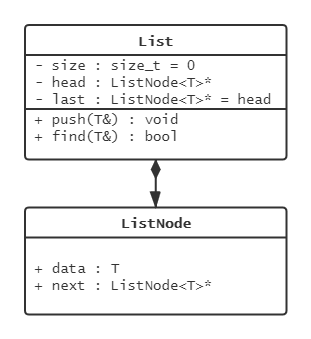
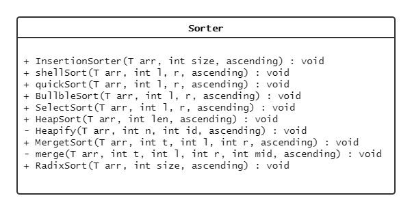
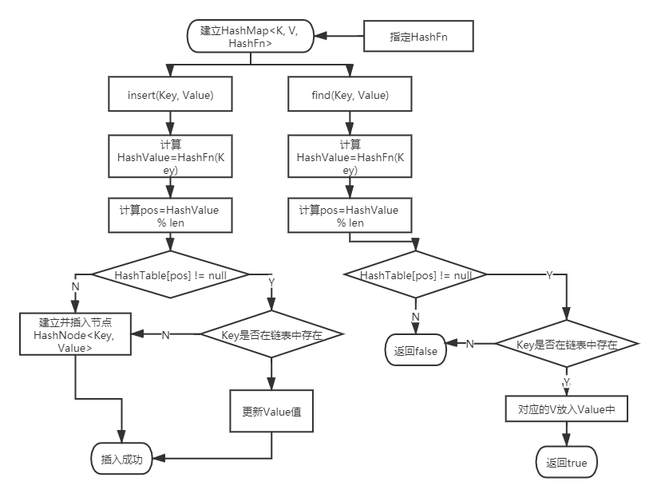
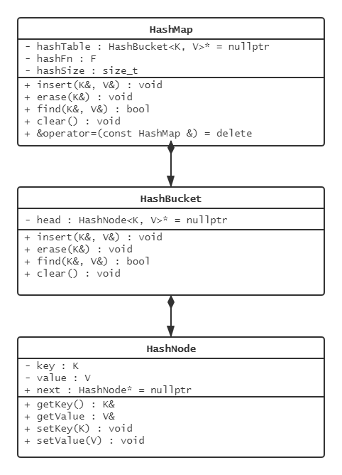
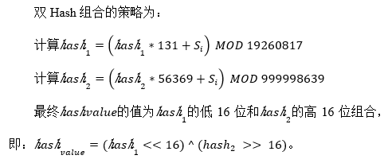

# 网络数据结构课设祖传课题

| 文件                     | 功能                      |
| ------------------------ | ------------------------- |
| LinkedList.h             | 单链表模板实现            |
| HashNode.h               | `HashMap`节点和桶的实现   |
| HashMap.h                | `HashMap`方案实现         |
| Sorter.hpp               | 排序模板类的实现          |
| password_Hash_random.cpp | 随机生成password数据      |
| random_id.cpp            | 生成user数据              |
| binary_search.cpp        | 二分查找user数据          |
| password_BST.cpp         | 二叉搜索树统计个数        |
| password_Hash.cpp        | `HashMap`统计个数         |
| password_Hash_Search.cpp | ` Hash`查找`password`数据 |

# 主要设计

本结果采用泛型的设计思想，通过抽象并封装成模板类。因为这些类主要用于存储和组织一些具有普遍性的数据元素，若一个程序的功能是对某种特定的数据类型进行处理，则将所处理的数据类型说明为参数，就可以把这个程序改写成模板，模板可以让程序对任何其他数据类型进行同样方式的处理。从而提高了代码的复用性，减少代码冗余度，提高了编码效率。

本程序因需要使用大量的排序和搜索，因此设计并封装了四个模板类：`LinkedList.h`、`HashNode.h`、`HashMap.h`、`Sorter.hpp`，分别表示表示`单向链表、哈希节点、哈希表和排序类`。

LinkedList.h作为链表类，考虑整体的适用性和效率上的不退化问题，设立使用成员头结点和尾节点。由于但链表的单向有序性，为了不让插入和删除的复杂度退化至$O(n)$，所以记录并维护尾结点的指针，使插入和删除的时间复杂度达到$O(1)$。

# 模型

链表模型

Sorter模板模型

HashMap流程

HashMap模板模型

双Hash策略说明

# 排序测试

开启O2优化

| **算法名称** | password降序消耗时间/s | user字段消耗时间/s |
| ------------ | ---------------------- | ------------------ |
| 冒泡排序     | 4.484                  | 7036.437           |
| 直接插入排序 | 2.110                  | 4223.156           |
| 选择排序     | 1.843                  | 2227.719           |
| 希尔排序     | 0.016                  | 1.484              |
| 归并排序     | 0.015                  | 1.000              |
| 堆排序       | 0.000                  | 0.656              |
| 基数排序     | 0.000                  | 0.343              |
| 快速排序     | 0.000                  | 0.203              |

