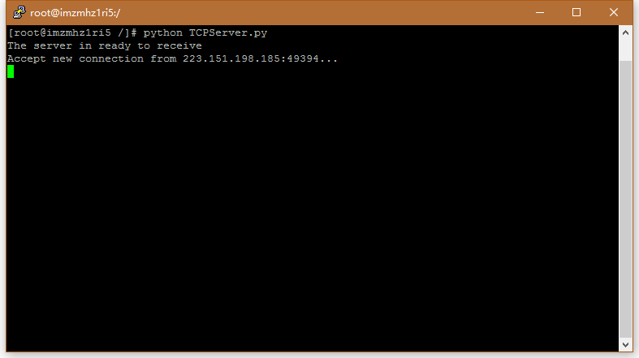
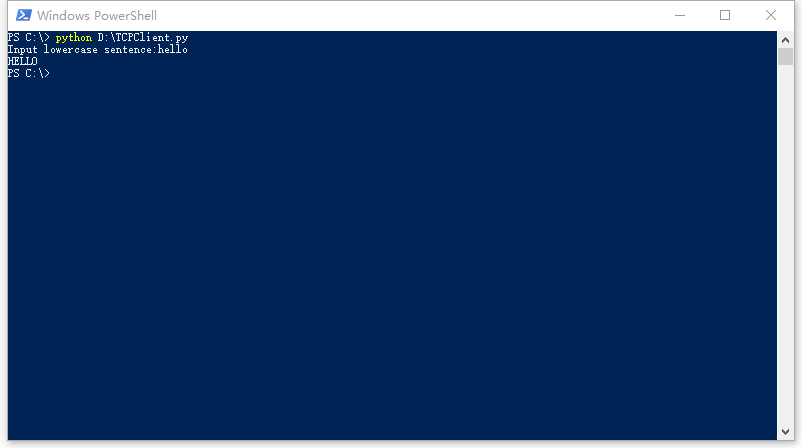

# TCP套接字编程

## 描述

《自顶向下方法（原书第6版）》第2.7.2节给出了一个使用Python的TCP套接字编程实例。实现了一个简单的TCP通信程序。

书中代码基于Python2，本文采用Python3，所以针对字符编码问题做了一些简单修改。

## 代码

客户端程序`TCPClient.py`创建一个TCP套接字，然后向指定服务器地址和端口发起连接，等待服务器连接后，再将用户输入的字符串通过套接字发送，其后将服务器返回的消息显示出来。

服务端程序`TCPServer.py`一直保持一个TCP欢迎套接字，可接收任何客户端的连接请求。在接收到客户端的连接请求后，创建一个新的TCP连接套接字用于单独与该客户通信，同时显示客户端地址和端口。在接收到客户端发来的字符串后，将其改为大写，然后向客户端返回修改后的字符串。 最后，关闭TCP连接套接字。

**TCPClient.py**

```python
from socket import *
serverName = '191.101.232.165' # 指定服务器地址
serverPort = 12000
clientSocket = socket(AF_INET, SOCK_STREAM) # 建立TCP套接字，使用IPv4协议
clientSocket.connect((serverName,serverPort)) # 向服务器发起连接

sentence = input('Input lowercase sentence:').encode() # 用户输入信息，并编码为bytes以便发送
clientSocket.send(sentence) # 将信息发送到服务器
modifiedSentence = clientSocket.recvfrom(1024) # 从服务器接收信息
print(modifiedSentence[0].decode()) # 显示信息
clientSocket.close() # 关闭套接字
```

**TCPServer .py**

```python
from socket import *
serverPort = 12000
serverSocket = socket(AF_INET, SOCK_STREAM) # 创建TCP欢迎套接字，使用IPv4协议
serverSocket.bind(('',serverPort)) # 将TCP欢迎套接字绑定到指定端口
serverSocket.listen(1) # 最大连接数为1
print("The server in ready to receive")

while True:
	connectionSocket, addr = serverSocket.accept() # 接收到客户连接请求后，建立新的TCP连接套接字
	print('Accept new connection from %s:%s...' % addr)
	sentence = connectionSocket.recv(1024) # 获取客户发送的字符串
	capitalizedSentence = sentence.upper() # 将字符串改为大写
	connectionSocket.send(capitalizedSentence) # 向用户发送修改后的字符串
	connectionSocket.close() # 关闭TCP连接套接字
```

**代码文件**

[TCPServer.py](source/TCPServer.py)

[TCPClient.py](source/TCPClient.py)

## 运行效果

先在一台机器上启动服务器程序，然后在另一台机器上启动客户端程序。运行效果如下：

**服务器端:**



**客户端：**



